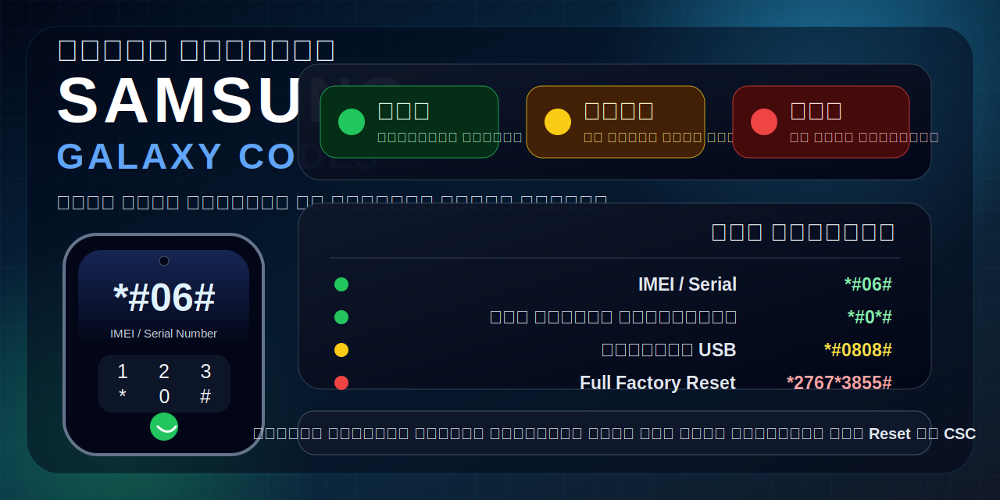

# 📱 أكواد سامسونج Samsung Codes

هذه نسخة مرتبة: **كل الأكواد الشائعة لسامسونج مع تعريف بسيط ودرجة أمان موحدة**.

## درجة الأمان

| الرخصة | المعنى |
|---|---|
| 🟢 آمن | للعرض أو الفحص فقط |
| 🟡 حساس | لا تغيّر الإعدادات إلا إذا كنت تعرف النتيجة |
| 🔴 خطر | قد يمسح البيانات أو يغيّر إعدادات حساسة |

## 🟢 أكواد آمنة غالبًا

| الكود | التعريف | الأمان |
|---|---|---|
| `*#06#` | عرض IMEI / Serial | 🟢 آمن |
| `*#0*#` | فحص الشاشة، اللمس، الصوت، الكاميرا، الحساسات | 🟢 آمن |
| `*#1234#` | عرض إصدار AP / CP / CSC | 🟢 آمن |
| `*#12580*369#` | معلومات الهاردوير والسوفتوير وتاريخ التصنيع | 🟢 آمن |
| `*#0228#` | معلومات البطارية والفولت والحرارة | 🟢 آمن |
| `*#7353#` | قائمة فحص سريعة | 🟢 آمن |
| `*#1111#` | إصدار Software FTA | 🟢 آمن |
| `*#2222#` | إصدار Hardware FTA | 🟢 آمن |
| `*#44336#` | معلومات Build / إصدار النظام | 🟢 آمن |
| `*#*#4636#*#*` | معلومات الهاتف، البطارية، الشبكة، Wi‑Fi | 🟢 آمن |
| `*#*#3264#*#*` | معلومات RAM | 🟢 آمن |
| `*#*#1234#*#*` | معلومات Firmware لبعض الأجهزة | 🟢 آمن |
| `*#*#1111#*#*` | معلومات Software لبعض الأجهزة | 🟢 آمن |
| `*#*#2222#*#*` | معلومات Hardware لبعض الأجهزة | 🟢 آمن |

## 🟡 الشبكة والاتصال

| الكود | التعريف | الأمان |
|---|---|---|
| `*#0011#` | Service Mode / معلومات الشبكة والواي فاي | 🟢 آمن |
| `*#2263#` | اختيار ترددات الشبكة Band Selection | 🟡 حساس |
| `*#2683662#` | Service Mode متقدم | 🟡 حساس |
| `*#197328640#` | Service Mode قديم | 🟡 حساس |
| `*#9090#` | Diagnostic Configuration | 🟡 حساس |
| `*#9900#` | SysDump / Logs / Debug | 🟡 حساس |
| `*#7465625#` | حالة قفل الشبكة SIM Lock | 🟢 آمن |
| `*7465625*638*#` | إعداد Network Lock | 🟡 حساس |
| `#7465625*638*#` | تعطيل Network Lock | 🟡 حساس |
| `*7465625*782*#` | إعداد Subset Lock | 🟡 حساس |
| `#7465625*782*#` | تعطيل Subset Lock | 🟡 حساس |
| `*7465625*77*#` | إعداد SP Lock | 🟡 حساس |
| `#7465625*77*#` | تعطيل SP Lock | 🟡 حساس |
| `*7465625*27*#` | إعداد CP Lock | 🟡 حساس |
| `#7465625*27*#` | تعطيل CP Lock | 🟡 حساس |

## 🟢 Wi‑Fi / Bluetooth / GPS

| الكود | التعريف | الأمان |
|---|---|---|
| `*#232338#` | عرض Wi‑Fi MAC Address | 🟢 آمن |
| `*#232339#` | اختبار Wi‑Fi | 🟢 آمن |
| `*#526#` | WLAN Test | 🟢 آمن |
| `*#528#` | WLAN Engineering Mode | 🟡 حساس |
| `*#232331#` | اختبار Bluetooth | 🟢 آمن |
| `*#232337#` | عرض Bluetooth MAC Address | 🟢 آمن |
| `*#1472365#` | GPS Test | 🟢 آمن |
| `*#1575#` | GPS Control Menu | 🟡 حساس |
| `*#*#1472365#*#*` | GPS Test لبعض أجهزة أندرويد | 🟢 آمن |
| `*#*#1575#*#*` | GPS Test إضافي | 🟡 حساس |
| `*#*#232339#*#*` | Wi‑Fi Test لبعض الأجهزة | 🟢 آمن |
| `*#*#526#*#*` | WLAN Test لبعض الأجهزة | 🟢 آمن |
| `*#*#528#*#*` | WLAN Engineering لبعض الأجهزة | 🟡 حساس |
| `*#*#232338#*#*` | Wi‑Fi MAC لبعض الأجهزة | 🟢 آمن |
| `*#*#232331#*#*` | Bluetooth Test لبعض الأجهزة | 🟢 آمن |
| `*#*#232337#*#*` | Bluetooth Address لبعض الأجهزة | 🟢 آمن |

## 🟢 الصوت والحساسات

| الكود | التعريف | الأمان |
|---|---|---|
| `*#0673#` | Audio Test | 🟢 آمن |
| `*#0289#` | Speaker / Melody Test | 🟢 آمن |
| `*#0283#` | Audio Loopback Test | 🟢 آمن |
| `*#0588#` | Proximity Sensor Test | 🟢 آمن |
| `*#0589#` | Light Sensor Test | 🟢 آمن |
| `*#0842#` | Vibration / Backlight Test | 🟢 آمن |
| `*#0782#` | Real Time Clock Test | 🟢 آمن |
| `*#*#2664#*#*` | Touch Screen Test | 🟢 آمن |
| `*#*#0588#*#*` | Proximity Test لبعض الأجهزة | 🟢 آمن |
| `*#*#0673#*#*` | Audio Test لبعض الأجهزة | 🟢 آمن |
| `*#*#0289#*#*` | Speaker Test لبعض الأجهزة | 🟢 آمن |

## 🟡 USB / Logs / Debug

| الكود | التعريف | الأمان |
|---|---|---|
| `*#0808#` | إعدادات USB | 🟡 حساس |
| `*#7284#` | USB / UART Settings | 🟡 حساس |
| `*#872564#` | USB Logging Control | 🟡 حساس |
| `*#745#` | RIL Dump Menu | 🟡 حساس |
| `*#746#` | Debug Dump Menu | 🟡 حساس |
| `*#32489#` | Ciphering / Network Info لبعض الأجهزة | 🟡 حساس |
| `*#4238378#` | GCF Configuration لبعض الأجهزة | 🟡 حساس |

## 🟢 أكواد المكالمات والتحويل

| الكود | التعريف | الأمان |
|---|---|---|
| `*#21#` | فحص تحويل جميع المكالمات | 🟢 آمن |
| `*#62#` | فحص التحويل عند عدم التوفر | 🟢 آمن |
| `*#61#` | فحص التحويل عند عدم الرد | 🟢 آمن |
| `*#67#` | فحص التحويل عند الانشغال | 🟢 آمن |
| `##002#` | إلغاء جميع تحويلات المكالمات | 🟢 آمن |
| `*43#` | تفعيل انتظار المكالمات | 🟢 آمن |
| `#43#` | إلغاء انتظار المكالمات | 🟢 آمن |
| `*#43#` | فحص حالة انتظار المكالمات | 🟢 آمن |
| `#31#رقم_الجوال` | إخفاء الرقم لمكالمة واحدة | 🟢 آمن |
| `*31#رقم_الجوال` | إظهار الرقم لمكالمة واحدة | 🟢 آمن |

## 🟡 أكواد نظام قديمة أو قد لا تعمل

| الكود | التعريف | الأمان |
|---|---|---|
| `*#*#7594#*#*` | تغيير سلوك زر التشغيل في أجهزة قديمة | 🟡 حساس |
| `*#*#8255#*#*` | Google Talk Service Monitor قديم | 🟢 آمن |
| `*#*#4986*2650468#*#*` | معلومات PDA / Phone / Hardware / RFCallDate | 🟢 آمن |
| `*#3282*727336*#` | Data Usage / Data Create Menu | 🟢 آمن |

## 🔴 أكواد خطيرة جدًا

| الكود | التعريف | الأمان |
|---|---|---|
| `*#7780#` | Factory Reset / إعادة ضبط | 🔴 خطر |
| `*#*#7780#*#*` | Factory Reset لبعض أجهزة أندرويد | 🔴 خطر |
| `*2767*3855#` | Full Factory Reset وقد يمسح الجهاز بالكامل | 🔴 خطر |
| `*2767*2878#` | Custom Reset | 🔴 خطر |
| `*2767*4387264636#` | Reset قديم لبعض الموديلات | 🔴 خطر |
| `*#272*IMEI#` | تغيير CSC / منطقة الجهاز وقد يمسح البيانات | 🔴 خطر |

## ⭐ الأكواد التي تحتاجها فعليًا

| الاستخدام | الكود | الأمان |
|---|---|---|
| معرفة IMEI | `*#06#` | 🟢 آمن |
| فحص الجهاز كامل | `*#0*#` | 🟢 آمن |
| معلومات الشبكة والواي فاي | `*#0011#` | 🟢 آمن |
| معلومات البطارية | `*#0228#` | 🟢 آمن |
| إصدار النظام | `*#1234#` | 🟢 آمن |
| إعدادات USB | `*#0808#` | 🟡 حساس |
| إلغاء تحويل المكالمات | `##002#` | 🟢 آمن |

## ⚠️ تنبيه مهم

استخدم الأكواد الآمنة للمشاهدة والفحص فقط. لا تغيّر إعدادات داخل Service Mode أو USB أو Network Lock، ولا تستخدم أكواد Reset أو CSC إلا بعد أخذ نسخة احتياطية وفهم النتيجة.
